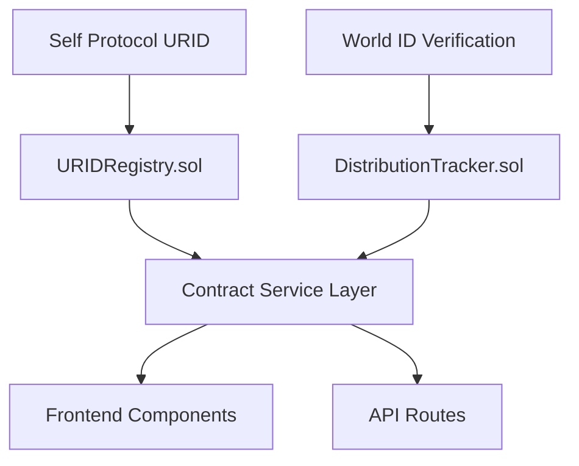
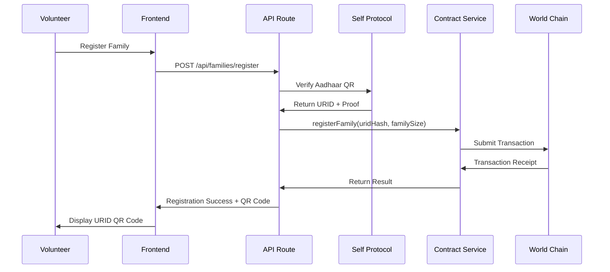
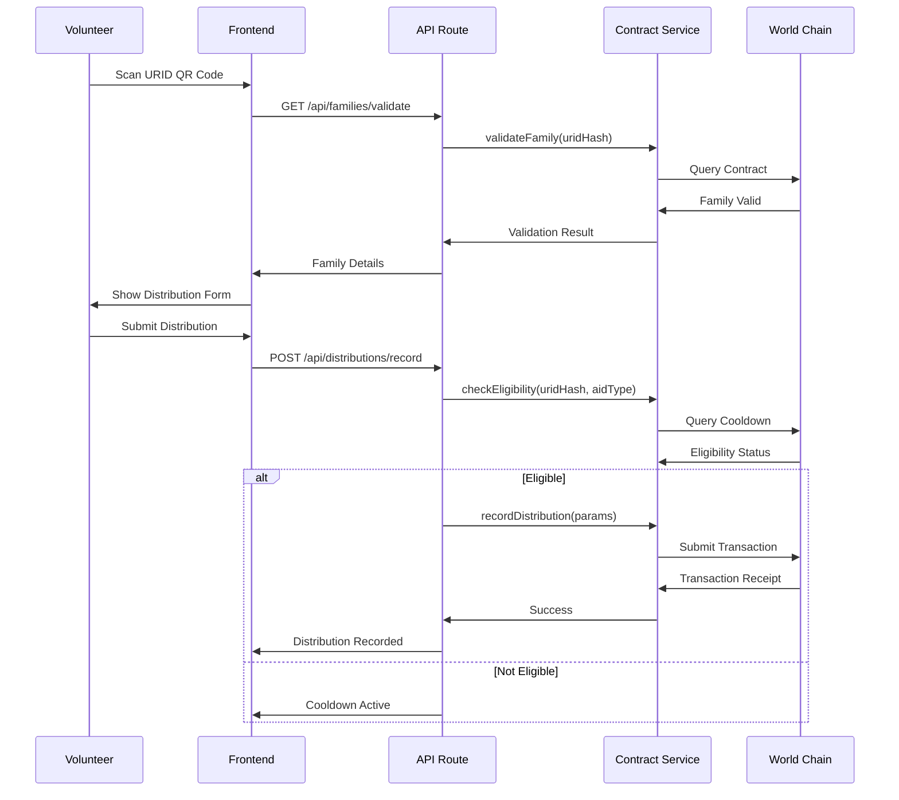

# Phase 2: Smart Contract Development & Integration Design

## Overview

Phase 2 focuses on deploying and integrating smart contracts for SewaChain's aid distribution system on World Chain. This phase establishes the blockchain foundation for URID registration, aid distribution tracking, and duplicate prevention mechanisms.

## Technology Stack & Dependencies

### Blockchain Infrastructure
- **Target Network**: World Chain Testnet/Mainnet
- **Smart Contract Language**: Solidity ^0.8.19
- **Development Framework**: Hardhat/Foundry
- **Web3 Library**: ethers.js v6.15.0
- **Contract Verification**: Blockscout/Etherscan

### Integration Dependencies
- **Frontend**: Next.js 15 with TypeScript
- **World ID**: MiniKit SDK v1.9.6
- **Self Protocol**: @selfxyz/core v1.1.0-beta.1
- **State Management**: React Context + Zustand

## Smart Contract Architecture

### Contract Hierarchy



### URIDRegistry Contract Design

#### Core Functionality
- **Family Registration**: Store hashed URIDs with family metadata
- **Validation**: Check family existence and active status
- **Batch Operations**: Support efficient multi-family registration
- **Access Control**: Owner-based permissions for status updates

#### Data Structures
```solidity
struct Family {
    bytes32 uridHash;        // Privacy-preserving URID hash
    uint256 familySize;      // Number of family members
    uint256 registrationTime; // Timestamp of registration
    address registeredBy;    // Volunteer who registered
    bool isActive;          // Active status flag
    bool exists;            // Existence flag
}
```

#### Key Operations
- `registerFamily(bytes32 _uridHash, uint256 _familySize)`
- `isValidFamily(bytes32 _uridHash) returns (bool)`
- `getFamilyInfo(bytes32 _uridHash) returns (Family)`
- `batchRegisterFamilies(bytes32[] _uridHashes, uint256[] _familySizes)`

### DistributionTracker Contract Design

#### Core Functionality
- **Distribution Recording**: Log all aid distributions with metadata
- **Duplicate Prevention**: Enforce cooldown periods per aid type
- **History Tracking**: Maintain complete distribution history
- **Volunteer Analytics**: Track distributions per volunteer nullifier

#### Data Structures
```solidity
enum AidType { FOOD, MEDICAL, SHELTER, CLOTHING, WATER, CASH }

struct Distribution {
    bytes32 uridHash;           // Beneficiary family hash
    bytes32 volunteerNullifier; // World ID volunteer identifier
    AidType aidType;           // Type of aid distributed
    uint256 timestamp;         // Distribution time
    uint256 quantity;          // Amount/quantity distributed
    string location;           // Distribution location
    bool confirmed;            // Confirmation status
    bool exists;              // Existence flag
}
```

#### Cooldown Mechanism
```solidity
mapping(bytes32 => mapping(AidType => uint256)) public lastDistribution;
mapping(AidType => uint256) public cooldownPeriods;

// Default cooldown periods
FOOD: 24 hours
MEDICAL: 1 hour
SHELTER: 7 days
CLOTHING: 30 days
WATER: 12 hours
CASH: 30 days
```

#### Key Operations
- `recordDistribution(bytes32 _uridHash, bytes32 _volunteerNullifier, AidType _aidType, uint256 _quantity, string _location)`
- `checkEligibility(bytes32 _uridHash, AidType _aidType) returns (bool eligible, uint256 timeUntilEligible)`
- `getDistributionHistory(bytes32 _uridHash) returns (Distribution[])`
- `batchRecordDistributions(...)`

## Contract Integration Service Layer

### ContractService Architecture

```typescript
interface IContractService {
  // URID Registry Operations
  registerFamily(uridHash: string, familySize: number): Promise<TransactionResult>
  validateFamily(uridHash: string): Promise<boolean>
  getFamilyInfo(uridHash: string): Promise<FamilyInfo>
  
  // Distribution Tracker Operations
  recordDistribution(params: DistributionParams): Promise<TransactionResult>
  checkEligibility(uridHash: string, aidType: AidType): Promise<EligibilityResult>
  getDistributionHistory(uridHash: string): Promise<Distribution[]>
  
  // Analytics & Statistics
  getContractStats(): Promise<ContractStats>
  getVolunteerStats(nullifier: string): Promise<VolunteerStats>
}
```

### Service Implementation Structure

```typescript
// src/services/ContractService.ts
export class ContractService implements IContractService {
  private uridRegistry: Contract
  private distributionTracker: Contract
  private provider: JsonRpcProvider
  private signer: Signer

  constructor(config: ContractConfig) {
    this.provider = new JsonRpcProvider(config.rpcUrl)
    this.signer = new Wallet(config.privateKey, this.provider)
    this.initializeContracts(config.contractAddresses)
  }

  private initializeContracts(addresses: ContractAddresses): void
  private handleTransactionError(error: any): TransactionResult
  private waitForConfirmation(tx: Transaction): Promise<TransactionReceipt>
}
```

### Configuration Management

```typescript
// src/config/contracts.ts
export interface ContractConfig {
  rpcUrl: string
  privateKey: string
  contractAddresses: {
    uridRegistry: string
    distributionTracker: string
  }
  gasSettings: {
    gasLimit: number
    gasPrice?: string
  }
}

export const getContractConfig = (network: 'testnet' | 'mainnet'): ContractConfig
```

## Integration Workflows

### Family Registration Flow



### Aid Distribution Flow



## API Integration Layer

### Family Management Endpoints

#### POST /api/families/register
```typescript
interface RegisterFamilyRequest {
  volunteerSession: string
  familyDetails: {
    headOfFamily: string
    familySize: number
    location: string
    contactNumber: string
  }
  aadhaarProof: {
    offlineQR: string
    passphrase: string
  }
}

interface RegisterFamilyResponse {
  success: boolean
  urid: string
  uridHash: string
  qrCodeDataURL: string
  transactionHash: string
}
```

#### GET /api/families/validate/:uridHash
```typescript
interface ValidateFamilyResponse {
  isValid: boolean
  familyInfo?: {
    familySize: number
    registrationTime: number
    registeredBy: string
    isActive: boolean
  }
  error?: string
}
```

### Distribution Management Endpoints

#### POST /api/distributions/record
```typescript
interface RecordDistributionRequest {
  uridHash: string
  volunteerSession: string
  distribution: {
    aidType: 'FOOD' | 'MEDICAL' | 'SHELTER' | 'CLOTHING' | 'WATER' | 'CASH'
    quantity: number
    location: string
    notes?: string
  }
}

interface RecordDistributionResponse {
  success: boolean
  distributionId: string
  transactionHash: string
  nextEligibleTime?: number
}
```

#### GET /api/distributions/eligibility/:uridHash/:aidType
```typescript
interface EligibilityResponse {
  eligible: boolean
  timeUntilEligible: number
  lastDistribution?: {
    timestamp: number
    quantity: number
    location: string
  }
}
```

#### GET /api/distributions/history/:uridHash
```typescript
interface DistributionHistoryResponse {
  distributions: Array<{
    distributionId: string
    aidType: string
    quantity: number
    location: string
    timestamp: number
    volunteerNullifier: string
    confirmed: boolean
  }>
  totalCount: number
}
```

## Frontend Component Integration

### Contract Status Provider

```typescript
// src/providers/ContractProvider.tsx
interface ContractContextType {
  isConnected: boolean
  networkId: number
  contractAddresses: ContractAddresses
  blockNumber: number
  gasPrice: bigint
  
  // Contract operations
  registerFamily: (params: RegisterFamilyParams) => Promise<TransactionResult>
  recordDistribution: (params: DistributionParams) => Promise<TransactionResult>
  validateFamily: (uridHash: string) => Promise<boolean>
  checkEligibility: (uridHash: string, aidType: AidType) => Promise<EligibilityResult>
}

export const ContractProvider: React.FC<{ children: ReactNode }>
export const useContract = (): ContractContextType
```

### Transaction Monitoring Component

```typescript
// src/components/TransactionMonitor.tsx
interface TransactionMonitorProps {
  transactionHash?: string
  onConfirmed: (receipt: TransactionReceipt) => void
  onError: (error: Error) => void
}

export const TransactionMonitor: React.FC<TransactionMonitorProps>
```

### Family Registration Component

```typescript
// src/components/FamilyRegistration.tsx
interface FamilyRegistrationProps {
  volunteerSession: VolunteerSession
  onRegistrationComplete: (result: RegistrationResult) => void
}

export const FamilyRegistration: React.FC<FamilyRegistrationProps>
```

### Distribution Recording Component

```typescript
// src/components/DistributionForm.tsx
interface DistributionFormProps {
  uridHash: string
  familyInfo: FamilyInfo
  volunteerSession: VolunteerSession
  onDistributionComplete: (result: DistributionResult) => void
}

export const DistributionForm: React.FC<DistributionFormProps>
```

## Error Handling & Recovery

### Contract Interaction Errors

```typescript
enum ContractErrorType {
  NETWORK_ERROR = 'NETWORK_ERROR',
  INSUFFICIENT_FUNDS = 'INSUFFICIENT_FUNDS',
  CONTRACT_REVERT = 'CONTRACT_REVERT',
  TIMEOUT = 'TIMEOUT',
  VALIDATION_FAILED = 'VALIDATION_FAILED'
}

interface ContractError {
  type: ContractErrorType
  message: string
  transactionHash?: string
  blockNumber?: number
  gasUsed?: number
  originalError?: any
}

class ContractErrorHandler {
  static handleError(error: any): ContractError
  static getRetryStrategy(errorType: ContractErrorType): RetryStrategy
  static formatUserMessage(error: ContractError): string
}
```

### Transaction Retry Logic

```typescript
interface RetryConfig {
  maxAttempts: number
  baseDelay: number
  maxDelay: number
  backoffMultiplier: number
}

class TransactionRetryService {
  async executeWithRetry<T>(
    operation: () => Promise<T>,
    config: RetryConfig
  ): Promise<T>
  
  private shouldRetry(error: ContractError, attempt: number): boolean
  private calculateDelay(attempt: number, config: RetryConfig): number
}
```

## Testing Strategy

### Unit Testing

```typescript
// tests/services/ContractService.test.ts
describe('ContractService', () => {
  describe('registerFamily', () => {
    it('should register family successfully')
    it('should handle duplicate URID registration')
    it('should validate input parameters')
    it('should handle network errors gracefully')
  })
  
  describe('recordDistribution', () => {
    it('should record distribution successfully')
    it('should enforce cooldown periods')
    it('should validate eligibility before recording')
    it('should handle concurrent distributions')
  })
})
```

### Integration Testing

```typescript
// tests/integration/SmartContractFlow.test.ts
describe('Smart Contract Integration', () => {
  it('should complete full family registration flow')
  it('should complete full distribution recording flow')
  it('should handle multiple concurrent operations')
  it('should maintain data consistency across contracts')
})
```

### Contract Testing

```typescript
// tests/contracts/URIDRegistry.test.ts
describe('URIDRegistry Contract', () => {
  it('should deploy successfully')
  it('should register families correctly')
  it('should prevent duplicate registrations')
  it('should validate family status correctly')
  it('should handle batch operations')
})
```

## Performance Considerations

### Gas Optimization

```typescript
interface GasOptimizationConfig {
  batchSize: number          // Maximum items per batch operation
  gasLimit: number          // Maximum gas per transaction
  gasPriceStrategy: 'fast' | 'standard' | 'safe'
  priorityFee: string       // EIP-1559 priority fee
}

class GasOptimizer {
  static estimateGas(operation: ContractOperation): Promise<bigint>
  static optimizeBatchSize(operations: ContractOperation[]): ContractOperation[][]
  static calculateOptimalGasPrice(network: string): Promise<GasPrice>
}
```

### Caching Strategy

```typescript
interface CacheConfig {
  familyValidationTTL: number    // Cache family validation results
  eligibilityCheckTTL: number    // Cache eligibility checks
  contractStatsTTL: number       // Cache contract statistics
}

class ContractDataCache {
  async getFamilyValidation(uridHash: string): Promise<boolean | null>
  async setFamilyValidation(uridHash: string, isValid: boolean): Promise<void>
  async getEligibility(uridHash: string, aidType: AidType): Promise<EligibilityResult | null>
  async invalidateFamily(uridHash: string): Promise<void>
}
```

## Security Considerations

### Input Validation

```typescript
class ContractInputValidator {
  static validateURIDHash(uridHash: string): ValidationResult
  static validateFamilySize(size: number): ValidationResult
  static validateAidType(aidType: string): ValidationResult
  static validateQuantity(quantity: number, aidType: AidType): ValidationResult
  static validateLocation(location: string): ValidationResult
}
```

### Access Control

```typescript
interface AccessControlConfig {
  volunteerVerificationRequired: boolean
  adminOperationsRestricted: boolean
  rateLimitEnabled: boolean
  maxOperationsPerHour: number
}

class ContractAccessControl {
  static verifyVolunteerSession(session: string): Promise<boolean>
  static checkRateLimit(volunteerNullifier: string): Promise<boolean>
  static validatePermissions(operation: string, user: UserContext): boolean
}
```

## Monitoring & Analytics

### Contract Event Monitoring

```typescript
interface EventMonitorConfig {
  contracts: ContractAddress[]
  eventTypes: EventType[]
  alertThresholds: AlertThreshold[]
  webhookEndpoints: string[]
}

class ContractEventMonitor {
  startMonitoring(config: EventMonitorConfig): void
  onFamilyRegistered(callback: (event: FamilyRegisteredEvent) => void): void
  onDistributionRecorded(callback: (event: DistributionEvent) => void): void
  getEventHistory(filters: EventFilters): Promise<ContractEvent[]>
}
```

### Performance Metrics

```typescript
interface PerformanceMetrics {
  transactionLatency: number
  gasUsageAverage: number
  successRate: number
  errorRate: number
  throughput: number
}

class ContractMetricsCollector {
  collectTransactionMetrics(tx: Transaction): void
  generatePerformanceReport(timeRange: TimeRange): PerformanceMetrics
  alertOnThresholdBreach(metric: MetricType, threshold: number): void
}
```

## Deployment Configuration

### Environment Setup

```typescript
// src/config/deployment.ts
interface DeploymentConfig {
  network: 'testnet' | 'mainnet'
  rpcUrl: string
  chainId: number
  contractAddresses: {
    uridRegistry: string
    distributionTracker: string
  }
  gasSettings: {
    gasLimit: number
    maxFeePerGas: string
    maxPriorityFeePerGas: string
  }
  monitoring: {
    enabled: boolean
    alertWebhook: string
  }
}

export const getDeploymentConfig = (env: string): DeploymentConfig
```

### Contract Deployment Scripts

```typescript
// scripts/deploy-contracts.ts
async function deployContracts(network: string): Promise<DeploymentResult> {
  // 1. Deploy URIDRegistry
  const uridRegistry = await deployURIDRegistry()
  
  // 2. Deploy DistributionTracker
  const distributionTracker = await deployDistributionTracker()
  
  // 3. Verify contracts on block explorer
  await verifyContract(uridRegistry.address, uridRegistry.constructorArgs)
  await verifyContract(distributionTracker.address, distributionTracker.constructorArgs)
  
  // 4. Update configuration files
  await updateContractAddresses({
    uridRegistry: uridRegistry.address,
    distributionTracker: distributionTracker.address
  })
  
  return {
    uridRegistry: uridRegistry.address,
    distributionTracker: distributionTracker.address,
    deploymentBlock: await ethers.provider.getBlockNumber()
  }
}
```


