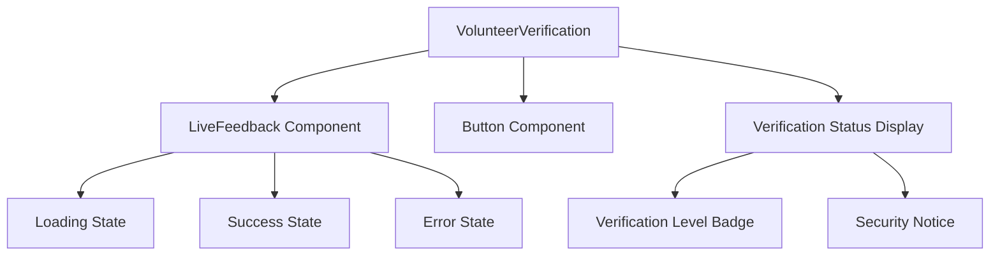
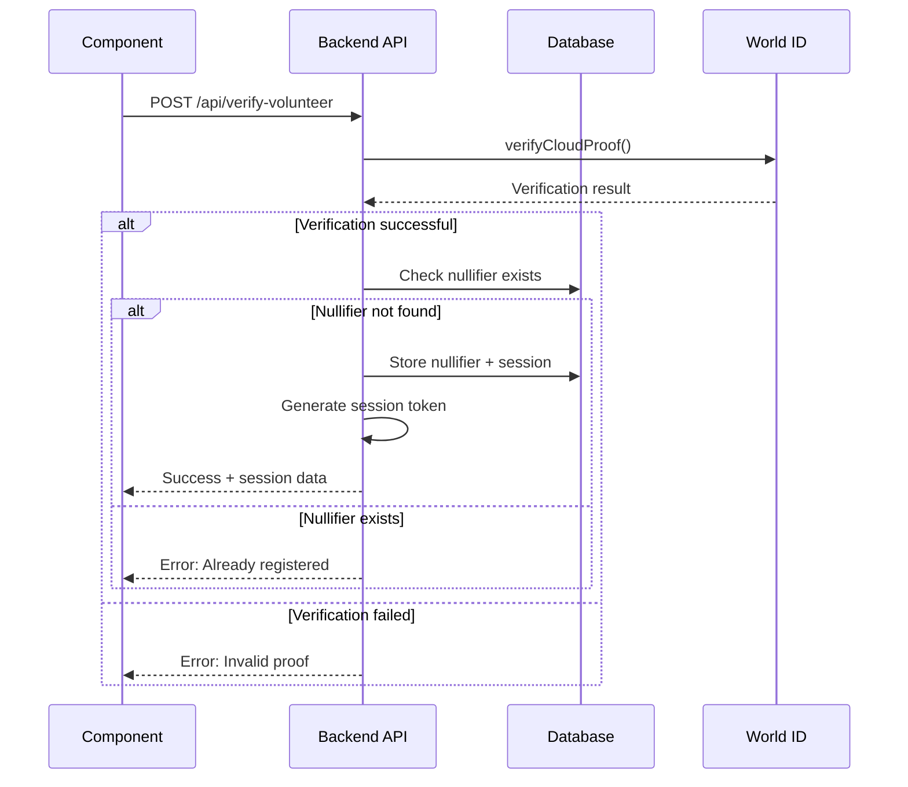
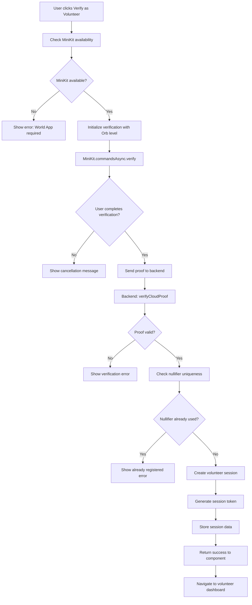

# Volunteer World ID Verification Component Design

## Overview

The Volunteer World ID Verification Component is a specialized verification system designed for aid distribution volunteers in the SewaChain platform. This component extends the existing World ID verification functionality to create secure volunteer sessions with Orb-level verification requirements, ensuring the highest security standards for volunteer onboarding.

## Technology Stack & Dependencies

- **MiniKit-JS SDK**: `@worldcoin/minikit-js` for World ID verification
- **MiniKit UI Kit**: `@worldcoin/mini-apps-ui-kit-react` for consistent UI components
- **Next.js**: Framework for API routes and server-side verification
- **TypeScript**: Type safety and better development experience
- **React**: Frontend component development

## Component Architecture

### Component Definition

```typescript
interface VolunteerVerificationProps {
  onVerified: (volunteerData: VolunteerSession) => void;
  onError?: (error: VerificationError) => void;
  disabled?: boolean;
  className?: string;
}

interface VolunteerSession {
  nullifierHash: string;
  sessionToken: string;
  verificationLevel: VerificationLevel;
  timestamp: number;
  volunteerId: string;
  permissions: VolunteerPermission[];
}

interface VerificationError {
  code: string;
  message: string;
  details?: any;
}

enum VolunteerPermission {
  DISTRIBUTE_AID = 'distribute_aid',
  VERIFY_BENEFICIARIES = 'verify_beneficiaries',
  VIEW_DISTRIBUTION_DATA = 'view_distribution_data',
  MANAGE_INVENTORY = 'manage_inventory'
}
```

### Component Hierarchy



### Props/State Management

**Component State:**
- `verificationState`: 'idle' | 'pending' | 'success' | 'failed'
- `errorDetails`: VerificationError | null
- `verificationResult`: VolunteerSession | null

**External Dependencies:**
- MiniKit async commands for verification flow
- Backend API for proof verification and session creation
- World Developer Portal configuration for "verify-volunteer" action

### Lifecycle Methods/Hooks

```typescript
// State management
const [verificationState, setVerificationState] = useState<VerificationState>('idle');
const [errorDetails, setErrorDetails] = useState<VerificationError | null>(null);

// Effect for cleanup and timeout handling
useEffect(() => {
  let timeoutId: NodeJS.Timeout;
  
  if (verificationState === 'failed') {
    timeoutId = setTimeout(() => {
      setVerificationState('idle');
      setErrorDetails(null);
    }, 3000);
  }
  
  return () => {
    if (timeoutId) clearTimeout(timeoutId);
  };
}, [verificationState]);
```

### Example Component Usage

```typescript
// In volunteer onboarding flow
<VolunteerVerification
  onVerified={(volunteerData) => {
    // Store volunteer session data
    localStorage.setItem('volunteerSession', JSON.stringify(volunteerData));
    // Navigate to volunteer dashboard
    router.push('/volunteer/dashboard');
  }}
  onError={(error) => {
    console.error('Volunteer verification failed:', error);
    // Show user-friendly error message
  }}
  className="w-full max-w-md"
/>
```

## API Integration Layer

### Backend Verification Endpoint

**Route**: `/api/verify-volunteer`

```typescript
interface VerifyVolunteerRequest {
  payload: ISuccessResult;
  action: string; // 'verify-volunteer'
  signal?: string;
}

interface VerifyVolunteerResponse {
  success: boolean;
  volunteerSession?: VolunteerSession;
  error?: {
    code: string;
    message: string;
  };
}
```

### MiniKit Integration Pattern

```typescript
const handleVolunteerVerification = async () => {
  try {
    setVerificationState('pending');
    
    // Use MiniKit async commands as recommended
    const { finalPayload } = await MiniKit.commandsAsync.verify({
      action: 'verify-volunteer', // Configured in World Developer Portal
      verification_level: VerificationLevel.Orb // Highest security requirement
    });
    
    // Backend verification using verifyCloudProof
    const response = await fetch('/api/verify-volunteer', {
      method: 'POST',
      headers: { 'Content-Type': 'application/json' },
      body: JSON.stringify({
        payload: finalPayload,
        action: 'verify-volunteer'
      })
    });
    
    const data = await response.json();
    
    if (data.success && data.volunteerSession) {
      setVerificationState('success');
      onVerified(data.volunteerSession);
    } else {
      throw new Error(data.error?.message || 'Verification failed');
    }
    
  } catch (error) {
    setVerificationState('failed');
    setErrorDetails({
      code: 'VERIFICATION_FAILED',
      message: error.message || 'Unknown verification error'
    });
    onError?.(errorDetails);
  }
};
```

## Data Models & Session Management

### Volunteer Session Schema

```typescript
interface VolunteerSession {
  // World ID verification data
  nullifierHash: string;        // For preventing duplicate registrations
  verificationLevel: VerificationLevel.Orb;
  
  // Session management
  sessionToken: string;         // JWT token for authenticated requests
  timestamp: number;            // Session creation time
  expiresAt: number;           // Session expiration time
  
  // Volunteer-specific data
  volunteerId: string;          // Unique volunteer identifier
  permissions: VolunteerPermission[];
  organizationId?: string;      // Associated aid organization
  verifiedAt: number;          // Verification timestamp
}
```

### Nullifier Hash Storage



## Business Logic Layer

### Verification Flow Architecture



### Security Considerations

1. **Orb-level Verification**: Enforces highest World ID security standard
2. **Nullifier Tracking**: Prevents duplicate volunteer registrations
3. **Session Token Management**: Secure JWT tokens with expiration
4. **Backend Verification**: All proofs verified server-side using `verifyCloudProof`

### Error Handling Strategy

```typescript
enum VerificationErrorCode {
  MINIKIT_UNAVAILABLE = 'MINIKIT_UNAVAILABLE',
  USER_CANCELLED = 'USER_CANCELLED',
  VERIFICATION_FAILED = 'VERIFICATION_FAILED',
  ALREADY_REGISTERED = 'ALREADY_REGISTERED',
  NETWORK_ERROR = 'NETWORK_ERROR',
  INVALID_PROOF = 'INVALID_PROOF'
}

const errorMessages: Record<VerificationErrorCode, string> = {
  MINIKIT_UNAVAILABLE: 'World App is required for volunteer verification',
  USER_CANCELLED: 'Verification was cancelled',
  VERIFICATION_FAILED: 'World ID verification failed',
  ALREADY_REGISTERED: 'This identity is already registered as a volunteer',
  NETWORK_ERROR: 'Network error occurred. Please try again.',
  INVALID_PROOF: 'Invalid verification proof'
};
```

## Testing Strategy

### Unit Testing Approach

```typescript
// Component testing with React Testing Library
describe('VolunteerVerification', () => {
  test('renders verification button in idle state', () => {
    render(<VolunteerVerification onVerified={mockOnVerified} />);
    expect(screen.getByText('Verify as Volunteer (Orb)')).toBeInTheDocument();
  });
  
  test('shows loading state during verification', async () => {
    mockMiniKit.commandsAsync.verify.mockResolvedValue(mockSuccessPayload);
    render(<VolunteerVerification onVerified={mockOnVerified} />);
    
    fireEvent.click(screen.getByText('Verify as Volunteer (Orb)'));
    expect(screen.getByText('Verifying...')).toBeInTheDocument();
  });
  
  test('calls onVerified with session data on success', async () => {
    const mockOnVerified = jest.fn();
    render(<VolunteerVerification onVerified={mockOnVerified} />);
    
    // Test successful verification flow
    await act(async () => {
      fireEvent.click(screen.getByText('Verify as Volunteer (Orb)'));
    });
    
    expect(mockOnVerified).toHaveBeenCalledWith({
      nullifierHash: expect.any(String),
      sessionToken: expect.any(String),
      verificationLevel: VerificationLevel.Orb,
      timestamp: expect.any(Number)
    });
  });
});
```

### API Route Testing

```typescript
// Backend API testing
describe('/api/verify-volunteer', () => {
  test('creates volunteer session for valid proof', async () => {
    const mockRequest = {
      payload: mockValidPayload,
      action: 'verify-volunteer'
    };
    
    const response = await POST(new Request('http://localhost/api/verify-volunteer', {
      method: 'POST',
      body: JSON.stringify(mockRequest)
    }));
    
    const data = await response.json();
    expect(data.success).toBe(true);
    expect(data.volunteerSession).toBeDefined();
  });
  
  test('rejects duplicate nullifier hash', async () => {
    // Pre-register a nullifier
    await storeNullifier(mockNullifierHash);
    
    const response = await POST(mockRequestWithDuplicateNullifier);
    const data = await response.json();
    
    expect(data.success).toBe(false);
    expect(data.error.code).toBe('ALREADY_REGISTERED');
  });
});
```

### Integration Testing

```typescript
// End-to-end testing with Cypress
describe('Volunteer Verification Flow', () => {
  it('completes volunteer verification and navigates to dashboard', () => {
    cy.visit('/volunteer-onboarding');
    cy.get('[data-testid="verify-volunteer-button"]').click();
    
    // Mock MiniKit verification success
    cy.window().then((win) => {
      win.MiniKit = mockMiniKitSuccess;
    });
    
    // Verify success state and navigation
    cy.get('[data-testid="verification-success"]').should('be.visible');
    cy.url().should('include', '/volunteer/dashboard');
  });
});
```
// Effect for cleanup and timeout handling
useEffect(() => {
  let timeoutId: NodeJS.Timeout;
  
  if (verificationState === 'failed') {
    timeoutId = setTimeout(() => {
      setVerificationState('idle');
      setErrorDetails(null);
    }, 3000);
  }
  
  return () => {
    if (timeoutId) clearTimeout(timeoutId);
  };
}, [verificationState]);
```

### Example Component Usage

```typescript
// In volunteer onboarding flow
<VolunteerVerification
  onVerified={(volunteerData) => {
    // Store volunteer session data
    localStorage.setItem('volunteerSession', JSON.stringify(volunteerData));
    // Navigate to volunteer dashboard
    router.push('/volunteer/dashboard');
  }}
  onError={(error) => {
    console.error('Volunteer verification failed:', error);
    // Show user-friendly error message
  }}
  className="w-full max-w-md"
/>
```

## API Integration Layer

### Backend Verification Endpoint

**Route**: `/api/verify-volunteer`

```typescript
interface VerifyVolunteerRequest {
  payload: ISuccessResult;
  action: string; // 'verify-volunteer'
  signal?: string;
}

interface VerifyVolunteerResponse {
  success: boolean;
  volunteerSession?: VolunteerSession;
  error?: {
    code: string;
    message: string;
  };
}
```

### MiniKit Integration Pattern

```typescript
const handleVolunteerVerification = async () => {
  try {
    setVerificationState('pending');
    
    // Use MiniKit async commands as recommended
    const { finalPayload } = await MiniKit.commandsAsync.verify({
      action: 'verify-volunteer', // Configured in World Developer Portal
      verification_level: VerificationLevel.Orb // Highest security requirement
    });
    
    // Backend verification using verifyCloudProof
    const response = await fetch('/api/verify-volunteer', {
      method: 'POST',
      headers: { 'Content-Type': 'application/json' },
      body: JSON.stringify({
        payload: finalPayload,
        action: 'verify-volunteer'
      })
    });
    
    const data = await response.json();
    
    if (data.success && data.volunteerSession) {
      setVerificationState('success');
      onVerified(data.volunteerSession);
    } else {
      throw new Error(data.error?.message || 'Verification failed');
    }
    
  } catch (error) {
    setVerificationState('failed');
    setErrorDetails({
      code: 'VERIFICATION_FAILED',
      message: error.message || 'Unknown verification error'
    });
    onError?.(errorDetails);
  }
};
```

## Data Models & Session Management

### Volunteer Session Schema

```typescript
interface VolunteerSession {
  // World ID verification data
  nullifierHash: string;        // For preventing duplicate registrations
  verificationLevel: VerificationLevel.Orb;
  
  // Session management
  sessionToken: string;         // JWT token for authenticated requests
  timestamp: number;            // Session creation time
  expiresAt: number;           // Session expiration time
  
  // Volunteer-specific data
  volunteerId: string;          // Unique volunteer identifier
  permissions: VolunteerPermission[];
  organizationId?: string;      // Associated aid organization
  verifiedAt: number;          // Verification timestamp
}
```

### Nullifier Hash Storage


## Business Logic Layer

### Verification Flow Architecture


### Security Considerations

1. **Orb-level Verification**: Enforces highest World ID security standard
2. **Nullifier Tracking**: Prevents duplicate volunteer registrations
3. **Session Token Management**: Secure JWT tokens with expiration
4. **Backend Verification**: All proofs verified server-side using `verifyCloudProof`

### Error Handling Strategy

```typescript
enum VerificationErrorCode {
  MINIKIT_UNAVAILABLE = 'MINIKIT_UNAVAILABLE',
  USER_CANCELLED = 'USER_CANCELLED',
  VERIFICATION_FAILED = 'VERIFICATION_FAILED',
  ALREADY_REGISTERED = 'ALREADY_REGISTERED',
  NETWORK_ERROR = 'NETWORK_ERROR',
  INVALID_PROOF = 'INVALID_PROOF'
}

const errorMessages: Record<VerificationErrorCode, string> = {
  MINIKIT_UNAVAILABLE: 'World App is required for volunteer verification',
  USER_CANCELLED: 'Verification was cancelled',
  VERIFICATION_FAILED: 'World ID verification failed',
  ALREADY_REGISTERED: 'This identity is already registered as a volunteer',
  NETWORK_ERROR: 'Network error occurred. Please try again.',
  INVALID_PROOF: 'Invalid verification proof'
};
```

## Testing Strategy

### Unit Testing Approach

```typescript
// Component testing with React Testing Library
describe('VolunteerVerification', () => {
  test('renders verification button in idle state', () => {
    render(<VolunteerVerification onVerified={mockOnVerified} />);
    expect(screen.getByText('Verify as Volunteer (Orb)')).toBeInTheDocument();
  });
  
  test('shows loading state during verification', async () => {
    mockMiniKit.commandsAsync.verify.mockResolvedValue(mockSuccessPayload);
    render(<VolunteerVerification onVerified={mockOnVerified} />);
    
    fireEvent.click(screen.getByText('Verify as Volunteer (Orb)'));
    expect(screen.getByText('Verifying...')).toBeInTheDocument();
  });
  
  test('calls onVerified with session data on success', async () => {
    const mockOnVerified = jest.fn();
    render(<VolunteerVerification onVerified={mockOnVerified} />);
    
    // Test successful verification flow
    await act(async () => {
      fireEvent.click(screen.getByText('Verify as Volunteer (Orb)'));
    });
    
    expect(mockOnVerified).toHaveBeenCalledWith({
      nullifierHash: expect.any(String),
      sessionToken: expect.any(String),
      verificationLevel: VerificationLevel.Orb,
      timestamp: expect.any(Number)
    });
  });
});
```

### API Route Testing

```typescript
// Backend API testing
describe('/api/verify-volunteer', () => {
  test('creates volunteer session for valid proof', async () => {
    const mockRequest = {
      payload: mockValidPayload,
      action: 'verify-volunteer'
    };
    
    const response = await POST(new Request('http://localhost/api/verify-volunteer', {
      method: 'POST',
      body: JSON.stringify(mockRequest)
    }));
    
    const data = await response.json();
    expect(data.success).toBe(true);
    expect(data.volunteerSession).toBeDefined();
  });
  
  test('rejects duplicate nullifier hash', async () => {
    // Pre-register a nullifier
    await storeNullifier(mockNullifierHash);
    
    const response = await POST(mockRequestWithDuplicateNullifier);
    const data = await response.json();
    
    expect(data.success).toBe(false);
    expect(data.error.code).toBe('ALREADY_REGISTERED');
  });
});
```

### Integration Testing

```typescript
// End-to-end testing with Cypress
describe('Volunteer Verification Flow', () => {
  it('completes volunteer verification and navigates to dashboard', () => {
    cy.visit('/volunteer-onboarding');
    cy.get('[data-testid="verify-volunteer-button"]').click();
    
    // Mock MiniKit verification success
    cy.window().then((win) => {
      win.MiniKit = mockMiniKitSuccess;
    });
    
    // Verify success state and navigation
    cy.get('[data-testid="verification-success"]').should('be.visible');
    cy.url().should('include', '/volunteer/dashboard');
  });
});
```


enum VolunteerPermission {
  DISTRIBUTE_AID = 'distribute_aid',
  VERIFY_BENEFICIARIES = 'verify_beneficiaries',
  VIEW_DISTRIBUTION_DATA = 'view_distribution_data',
  MANAGE_INVENTORY = 'manage_inventory'
}
```

### Component Hierarchy


### Props/State Management

**Component State:**
- `verificationState`: 'idle' | 'pending' | 'success' | 'failed'
- `errorDetails`: VerificationError | null
- `verificationResult`: VolunteerSession | null

**External Dependencies:**
- MiniKit async commands for verification flow
- Backend API for proof verification and session creation
- World Developer Portal configuration for "verify-volunteer" action

### Lifecycle Methods/Hooks

```typescript
// State management
const [verificationState, setVerificationState] = useState<VerificationState>('idle');
const [errorDetails, setErrorDetails] = useState<VerificationError | null>(null);

// Effect for cleanup and timeout handling
useEffect(() => {
  let timeoutId: NodeJS.Timeout;
  
  if (verificationState === 'failed') {
    timeoutId = setTimeout(() => {
      setVerificationState('idle');
      setErrorDetails(null);
    }, 3000);
  }
  
  return () => {
    if (timeoutId) clearTimeout(timeoutId);
  };
}, [verificationState]);
```

### Example Component Usage

```typescript
// In volunteer onboarding flow
<VolunteerVerification
  onVerified={(volunteerData) => {
    // Store volunteer session data
    localStorage.setItem('volunteerSession', JSON.stringify(volunteerData));
    // Navigate to volunteer dashboard
    router.push('/volunteer/dashboard');
  }}
  onError={(error) => {
    console.error('Volunteer verification failed:', error);
    // Show user-friendly error message
  }}
  className="w-full max-w-md"
/>
```

## API Integration Layer

### Backend Verification Endpoint

**Route**: `/api/verify-volunteer`

```typescript
interface VerifyVolunteerRequest {
  payload: ISuccessResult;
  action: string; // 'verify-volunteer'
  signal?: string;
}

interface VerifyVolunteerResponse {
  success: boolean;
  volunteerSession?: VolunteerSession;
  error?: {
    code: string;
    message: string;
  };
}
```

### MiniKit Integration Pattern

```typescript
const handleVolunteerVerification = async () => {
  try {
    setVerificationState('pending');
    
    // Use MiniKit async commands as recommended
    const { finalPayload } = await MiniKit.commandsAsync.verify({
      action: 'verify-volunteer', // Configured in World Developer Portal
      verification_level: VerificationLevel.Orb // Highest security requirement
    });
    
    // Backend verification using verifyCloudProof
    const response = await fetch('/api/verify-volunteer', {
      method: 'POST',
      headers: { 'Content-Type': 'application/json' },
      body: JSON.stringify({
        payload: finalPayload,
        action: 'verify-volunteer'
      })
    });
    
    const data = await response.json();
    
    if (data.success && data.volunteerSession) {
      setVerificationState('success');
      onVerified(data.volunteerSession);
    } else {
      throw new Error(data.error?.message || 'Verification failed');
    }
    
  } catch (error) {
    setVerificationState('failed');
    setErrorDetails({
      code: 'VERIFICATION_FAILED',
      message: error.message || 'Unknown verification error'
    });
    onError?.(errorDetails);
  }
};
```

## Data Models & Session Management

### Volunteer Session Schema

```typescript
interface VolunteerSession {
  // World ID verification data
  nullifierHash: string;        // For preventing duplicate registrations
  verificationLevel: VerificationLevel.Orb;
  
  // Session management
  sessionToken: string;         // JWT token for authenticated requests
  timestamp: number;            // Session creation time
  expiresAt: number;           // Session expiration time
  
  // Volunteer-specific data
  volunteerId: string;          // Unique volunteer identifier
  permissions: VolunteerPermission[];
  organizationId?: string;      // Associated aid organization
  verifiedAt: number;          // Verification timestamp
}
```

### Nullifier Hash Storage


## Business Logic Layer

### Verification Flow Architecture


### Security Considerations

1. **Orb-level Verification**: Enforces highest World ID security standard
2. **Nullifier Tracking**: Prevents duplicate volunteer registrations
3. **Session Token Management**: Secure JWT tokens with expiration
4. **Backend Verification**: All proofs verified server-side using `verifyCloudProof`

### Error Handling Strategy

```typescript
enum VerificationErrorCode {
  MINIKIT_UNAVAILABLE = 'MINIKIT_UNAVAILABLE',
  USER_CANCELLED = 'USER_CANCELLED',
  VERIFICATION_FAILED = 'VERIFICATION_FAILED',
  ALREADY_REGISTERED = 'ALREADY_REGISTERED',
  NETWORK_ERROR = 'NETWORK_ERROR',
  INVALID_PROOF = 'INVALID_PROOF'
}

const errorMessages: Record<VerificationErrorCode, string> = {
  MINIKIT_UNAVAILABLE: 'World App is required for volunteer verification',
  USER_CANCELLED: 'Verification was cancelled',
  VERIFICATION_FAILED: 'World ID verification failed',
  ALREADY_REGISTERED: 'This identity is already registered as a volunteer',
  NETWORK_ERROR: 'Network error occurred. Please try again.',
  INVALID_PROOF: 'Invalid verification proof'
};
```

## Testing Strategy

### Unit Testing Approach

```typescript
// Component testing with React Testing Library
describe('VolunteerVerification', () => {
  test('renders verification button in idle state', () => {
    render(<VolunteerVerification onVerified={mockOnVerified} />);
    expect(screen.getByText('Verify as Volunteer (Orb)')).toBeInTheDocument();
  });
  
  test('shows loading state during verification', async () => {
    mockMiniKit.commandsAsync.verify.mockResolvedValue(mockSuccessPayload);
    render(<VolunteerVerification onVerified={mockOnVerified} />);
    
    fireEvent.click(screen.getByText('Verify as Volunteer (Orb)'));
    expect(screen.getByText('Verifying...')).toBeInTheDocument();
  });
  
  test('calls onVerified with session data on success', async () => {
    const mockOnVerified = jest.fn();
    render(<VolunteerVerification onVerified={mockOnVerified} />);
    
    // Test successful verification flow
    await act(async () => {
      fireEvent.click(screen.getByText('Verify as Volunteer (Orb)'));
    });
    
    expect(mockOnVerified).toHaveBeenCalledWith({
      nullifierHash: expect.any(String),
      sessionToken: expect.any(String),
      verificationLevel: VerificationLevel.Orb,
      timestamp: expect.any(Number)
    });
  });
});
```

### API Route Testing

```typescript
// Backend API testing
describe('/api/verify-volunteer', () => {
  test('creates volunteer session for valid proof', async () => {
    const mockRequest = {
      payload: mockValidPayload,
      action: 'verify-volunteer'
    };
    
    const response = await POST(new Request('http://localhost/api/verify-volunteer', {
      method: 'POST',
      body: JSON.stringify(mockRequest)
    }));
    
    const data = await response.json();
    expect(data.success).toBe(true);
    expect(data.volunteerSession).toBeDefined();
  });
  
  test('rejects duplicate nullifier hash', async () => {
    // Pre-register a nullifier
    await storeNullifier(mockNullifierHash);
    
    const response = await POST(mockRequestWithDuplicateNullifier);
    const data = await response.json();
    
    expect(data.success).toBe(false);
    expect(data.error.code).toBe('ALREADY_REGISTERED');
  });
});
```

### Integration Testing

```typescript
// End-to-end testing with Cypress
describe('Volunteer Verification Flow', () => {
  it('completes volunteer verification and navigates to dashboard', () => {
    cy.visit('/volunteer-onboarding');
    cy.get('[data-testid="verify-volunteer-button"]').click();
    
    // Mock MiniKit verification success
    cy.window().then((win) => {
      win.MiniKit = mockMiniKitSuccess;
    });
    
    // Verify success state and navigation
    cy.get('[data-testid="verification-success"]').should('be.visible');
    cy.url().should('include', '/volunteer/dashboard');
  });
});
```