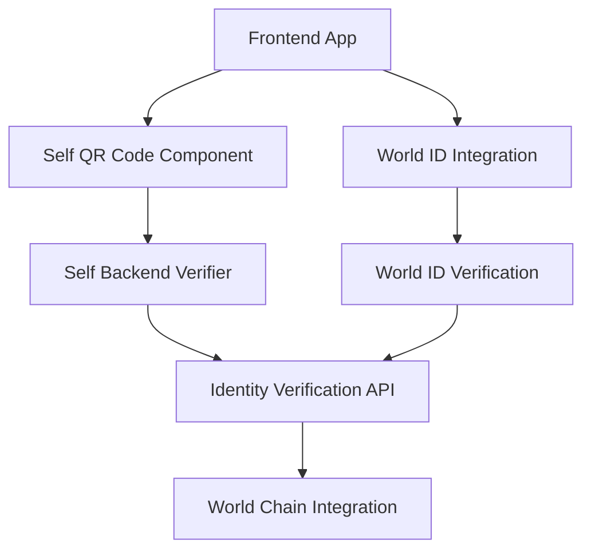

# SEWA ETH Global Project - Task Breakdown

## Overview

This project integrates Self Protocol for identity verification with World Chain/World ID ecosystem to create a comprehensive identity verification system. The implementation combines Self's zero-knowledge proof technology with World's proof-of-personhood verification.

## Architecture



## Technology Stack

### Frontend Dependencies
- `@selfxyz/qrcode` - QR code generation and display
- `@selfxyz/core` - Core utilities and universal links  
- `@worldcoin/minikit-js` - World App integration
- `ethers` - Ethereum utilities
- `React/Next.js` - Frontend framework

### Backend Dependencies
- `@selfxyz/core` - Self Protocol backend verification
- Node.js v16+ - Runtime environment

## Task Breakdown

### Phase 1: Project Setup & Environment Configuration

#### Task 1.1: Initialize Project Structure
**Priority:** High  
**Estimated Time:** 2 hours  
**Dependencies:** None

**Requirements:**
- Create Next.js project with TypeScript
- Set up project folder structure
- Configure environment variables template
- Install base dependencies

**Acceptance Criteria:**
- [ ] Next.js project created with TypeScript support
- [ ] Folder structure includes `/components`, `/pages/api`, `/lib`, `/types`
- [ ] `.env.local.example` file with required environment variables
- [ ] Package.json includes all necessary dependencies

**Environment Variables Required:**
```
NEXT_PUBLIC_SELF_APP_NAME=
NEXT_PUBLIC_SELF_SCOPE=
NEXT_PUBLIC_SELF_ENDPOINT=
NEXT_PUBLIC_WORLD_APP_ID=
APP_ID=
DEV_PORTAL_API_KEY=
```

#### Task 1.2: Install and Configure Dependencies
**Priority:** High  
**Estimated Time:** 1 hour  
**Dependencies:** Task 1.1

**Requirements:**
- Install Self Protocol packages
- Install World ID/MiniKit packages
- Configure TypeScript types
- Set up development tools

**Acceptance Criteria:**
- [ ] All Self Protocol packages installed (`@selfxyz/qrcode`, `@selfxyz/core`)
- [ ] World ID packages installed (`@worldcoin/minikit-js`)
- [ ] TypeScript configured with proper types
- [ ] ESLint and Prettier configured

### Phase 2: Self Protocol Integration

#### Task 2.1: Implement Self QR Code Component
**Priority:** High  
**Estimated Time:** 4 hours  
**Dependencies:** Task 1.2

**Requirements:**
- Create reusable Self QR code component
- Implement SelfAppBuilder configuration
- Add universal link support for mobile
- Handle verification states (loading, success, error)

**Acceptance Criteria:**
- [ ] `SelfQRCodeComponent` created with proper props interface
- [ ] SelfAppBuilder configured with correct parameters
- [ ] Universal link generation implemented
- [ ] Visual states for QR code (loading, ready, scanning, verified, error)
- [ ] Mobile-responsive design
- [ ] Error handling for invalid configurations

**Component Structure:**
```typescript
interface SelfQRCodeProps {
  onSuccess: (result: VerificationResult) => void;
  onError: (error: string) => void;
  scope: string;
  endpoint: string;
  disclosures: DisclosureConfig;
}
```

#### Task 2.2: Configure Self Verification Requirements
**Priority:** High  
**Estimated Time:** 2 hours  
**Dependencies:** Task 2.1

**Requirements:**
- Define verification configuration
- Set up disclosure requirements (nationality, gender, age verification)
- Configure OFAC and country exclusions
- Ensure frontend/backend configuration matching

**Acceptance Criteria:**
- [ ] Verification configuration defined with minimum age 18
- [ ] Nationality and gender disclosure enabled
- [ ] OFAC verification disabled for demo
- [ ] Configuration stored in environment variables
- [ ] Type definitions for disclosure configurations

#### Task 2.3: Implement Self Backend Verifier
**Priority:** High  
**Estimated Time:** 6 hours  
**Dependencies:** Task 2.2

**Requirements:**
- Create backend API endpoint for proof verification
- Implement SelfBackendVerifier configuration
- Handle proof verification logic
- Return structured verification results

**Acceptance Criteria:**
- [ ] `/api/verify-self` endpoint created
- [ ] SelfBackendVerifier properly initialized with config store
- [ ] Proof verification handles attestationId, proof, publicSignals, userContextData
- [ ] Proper error handling for invalid proofs
- [ ] Structured response format with verification details
- [ ] Configuration matching between frontend and backend

**API Structure:**
```typescript
// Request
interface VerificationRequest {
  attestationId: number;
  proof: string;
  publicSignals: string[];
  userContextData: any;
}

// Response
interface VerificationResponse {
  status: 'success' | 'error';
  result: boolean;
  credentialSubject?: any;
  details?: any;
  message?: string;
}
```

### Phase 3: World ID Integration

#### Task 3.1: Implement World ID Verification Command
**Priority:** High  
**Estimated Time:** 4 hours  
**Dependencies:** Task 1.2

**Requirements:**
- Integrate MiniKit verify command
- Create incognito action in Developer Portal
- Handle World ID proof verification
- Implement proper error handling

**Acceptance Criteria:**
- [ ] MiniKit verify command integrated
- [ ] Incognito action created and configured
- [ ] Verification level set to Orb by default
- [ ] Proper signal handling for additional data
- [ ] Error handling for verification failures
- [ ] Success callback implementation

**Verification Configuration:**
```typescript
interface VerifyCommandInput {
  action: string;
  signal?: string;
  verification_level: VerificationLevel;
}
```

#### Task 3.2: Implement World ID Backend Verification
**Priority:** High  
**Estimated Time:** 3 hours  
**Dependencies:** Task 3.1

**Requirements:**
- Create backend endpoint for World ID proof verification
- Use Developer Portal API for proof verification
- Handle different verification levels
- Store verification results

**Acceptance Criteria:**
- [ ] `/api/verify-world-id` endpoint created
- [ ] Integration with Developer Portal verify API
- [ ] Proper handling of proof, merkle_root, nullifier_hash
- [ ] Error handling for invalid or reused proofs
- [ ] Verification result storage and retrieval

#### Task 3.3: Implement Wallet Authentication
**Priority:** Medium  
**Estimated Time:** 5 hours  
**Dependencies:** Task 3.1

**Requirements:**
- Implement SIWE (Sign-In with Ethereum) flow
- Create nonce generation endpoint
- Handle wallet authentication verification
- Manage user sessions

**Acceptance Criteria:**
- [ ] SIWE message generation implemented
- [ ] Nonce creation and validation
- [ ] Wallet signature verification
- [ ] Session management with NextAuth or similar
- [ ] User object creation with wallet address and username

### Phase 4: Mini App Integration

#### Task 4.1: Implement World App Mini App Structure
**Priority:** Medium  
**Estimated Time:** 6 hours  
**Dependencies:** Task 3.2

**Requirements:**
- Create Mini App compatible interface
- Implement MiniKit commands integration
- Add share functionality for viral growth
- Handle Mini App lifecycle events

**Acceptance Criteria:**
- [ ] Mini App interface responsive and mobile-optimized
- [ ] MiniKit properly installed and configured
- [ ] Share command implemented for user referrals
- [ ] Proper handling of Mini App permissions
- [ ] Universal link support for World App integration

#### Task 4.2: Implement Notification System
**Priority:** Low  
**Estimated Time:** 4 hours  
**Dependencies:** Task 4.1

**Requirements:**
- Request notification permissions
- Implement notification sending via API
- Create notification templates
- Handle notification responses

**Acceptance Criteria:**
- [ ] Permission request implementation
- [ ] Integration with send-notification API endpoint
- [ ] Localized notification templates
- [ ] Notification open rate tracking
- [ ] Proper error handling for permission denied

### Phase 5: Integration & User Flow

#### Task 5.1: Create Main Verification Page
**Priority:** High  
**Estimated Time:** 4 hours  
**Dependencies:** Task 2.1, Task 3.1

**Requirements:**
- Combine Self and World ID verification flows
- Create unified user interface
- Handle verification state management
- Implement progressive verification flow

**Acceptance Criteria:**
- [ ] Main verification page with both Self and World ID options
- [ ] State management for verification progress
- [ ] Visual feedback for each verification step
- [ ] Error handling and recovery flows
- [ ] Success page with verification details

#### Task 5.2: Implement Verification Result Display
**Priority:** Medium  
**Estimated Time:** 3 hours  
**Dependencies:** Task 5.1

**Requirements:**
- Display verified identity attributes
- Show verification confidence levels
- Create shareable verification badges
- Implement verification history

**Acceptance Criteria:**
- [ ] Clean display of verified attributes (nationality, age, gender)
- [ ] Verification timestamp and method shown
- [ ] Shareable verification status
- [ ] Verification history for user
- [ ] Privacy controls for attribute display

#### Task 5.3: Error Handling & Edge Cases
**Priority:** Medium  
**Estimated Time:** 4 hours  
**Dependencies:** Task 5.2

**Requirements:**
- Comprehensive error handling
- Fallback mechanisms for failed verifications
- User guidance for common issues
- Retry mechanisms

**Acceptance Criteria:**
- [ ] Detailed error messages for common failure scenarios
- [ ] Retry buttons for transient failures
- [ ] Help documentation for troubleshooting
- [ ] Graceful degradation when services unavailable
- [ ] Logging for debugging verification issues

### Phase 6: Testing & Optimization

#### Task 6.1: Implement Unit & Integration Tests
**Priority:** Medium  
**Estimated Time:** 6 hours  
**Dependencies:** Task 5.3

**Requirements:**
- Unit tests for verification components
- Integration tests for API endpoints
- Mock implementations for Self and World ID
- End-to-end test scenarios

**Acceptance Criteria:**
- [ ] Jest test suite set up
- [ ] Unit tests for React components (>80% coverage)
- [ ] API endpoint integration tests
- [ ] Mock implementations for external services
- [ ] E2E tests with Playwright or Cypress

#### Task 6.2: Performance Optimization
**Priority:** Low  
**Estimated Time:** 3 hours  
**Dependencies:** Task 6.1

**Requirements:**
- Optimize QR code generation performance
- Implement caching for verification results
- Minimize bundle size
- Improve loading states

**Acceptance Criteria:**
- [ ] QR code generation optimized for mobile devices
- [ ] Verification result caching implemented
- [ ] Bundle analysis and optimization
- [ ] Smooth loading states and transitions
- [ ] Performance metrics tracking

#### Task 6.3: Security Audit & Hardening
**Priority:** High  
**Estimated Time:** 4 hours  
**Dependencies:** Task 6.2

**Requirements:**
- Security review of verification endpoints
- Input validation and sanitization
- Rate limiting implementation
- Environment variable security

**Acceptance Criteria:**
- [ ] All API endpoints have proper input validation
- [ ] Rate limiting implemented for verification endpoints
- [ ] Environment variables properly secured
- [ ] CORS configuration review
- [ ] Security headers implemented

## Critical Configuration Requirements

### Frontend Environment Variables
```bash
NEXT_PUBLIC_SELF_APP_NAME="SEWA Identity Verification"
NEXT_PUBLIC_SELF_SCOPE="sewa-eth-global"
NEXT_PUBLIC_SELF_ENDPOINT="https://your-api-endpoint.com/api/verify-self"
NEXT_PUBLIC_WORLD_APP_ID="app_staging_your_app_id"
```

### Backend Environment Variables
```bash
APP_ID="app_staging_your_app_id"
DEV_PORTAL_API_KEY="your_world_developer_portal_api_key"
SELF_BACKEND_MOCK_MODE="true" # for testing
```

### Verification Configuration Matching
Both frontend and backend must use identical configuration:
- `minimumAge: 18`
- `ofac: false`
- `excludedCountries: []`
- Disclosure fields: `nationality: true, gender: true`

## Development Guidelines

### Code Quality Standards
- TypeScript strict mode enabled
- ESLint with React hooks rules
- Prettier for code formatting
- Conventional commits for version control

### Testing Requirements
- Minimum 80% test coverage
- All API endpoints must have integration tests
- Critical user flows must have E2E tests
- Mock implementations for external services

### Security Considerations
- Never store private keys in code or environment
- Validate all inputs on both client and server
- Use HTTPS for all API communications
- Implement proper CORS policies
- Rate limiting on verification endpoints

### Performance Targets
- First Contentful Paint < 2s
- QR code generation < 500ms
- Verification response < 3s
- Mobile-first responsive design
- Bundle size < 500KB gzipped

## Deployment Considerations

### Required External Services
- Self Protocol backend endpoint (publicly accessible)
- World Developer Portal account and API keys
- HTTPS endpoint for production (ngrok for development)

### World App Integration Requirements
- Mini App registered in World Developer Portal
- Proper universal link configuration
- Mobile-optimized interface
- Share functionality for viral growth

This task breakdown provides a comprehensive roadmap for implementing the SEWA identity verification system integrating Self Protocol and World ID technologies.